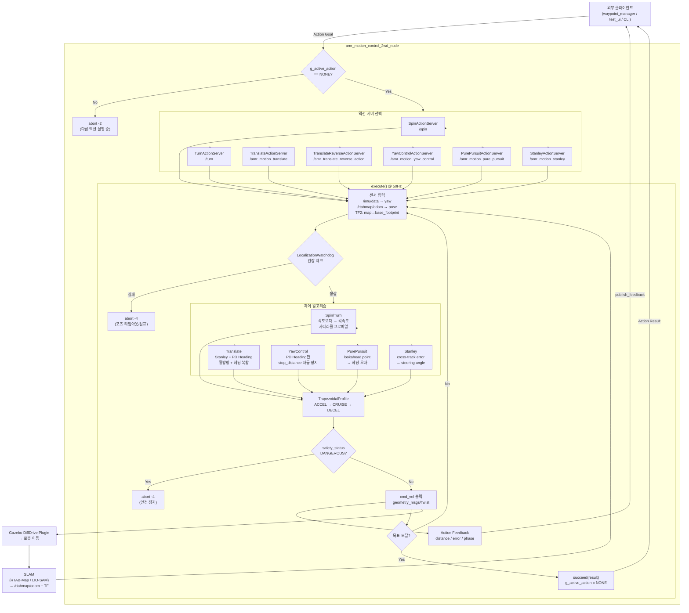

# AMR Motion Control — Data Flow

## 시스템 Flowchart



---

## 패키지 구조

```
amr_interfaces          # 커스텀 액션/서비스/메시지 정의
amr_motion_control_2wd  # 메인 모션 컨트롤 노드 (7개 액션 서버)
amr_motion_test_ui      # 테스트용 GUI/CLI
amr_motion_control_simulation  # SIL 시뮬레이션 (경로 예측)
```

---

## 전체 플로우

```
외부 클라이언트 (waypoint_manager / test_ui)
  │
  │  ROS2 Action Goal
  ▼
amr_motion_control_2wd_node
  │
  ├─ g_active_action 전역 뮤텍스 (동시 실행 방지)
  │
  ├─ [액션 선택]
  │    spin          → SpinActionServer         (제자리 회전)
  │    turn          → TurnActionServer         (아크 회전)
  │    amr_motion_translate      → TranslateActionServer      (직선 이동)
  │    amr_translate_reverse_action → TranslateReverseActionServer (후진)
  │    amr_motion_yaw_control    → YawControlActionServer     (헤딩 유지 주행)
  │    amr_motion_pure_pursuit   → PurePursuitActionServer    (경로 추종)
  │    amr_motion_stanley        → StanleyActionServer        (Stanley 경로 추종)
  │
  ▼
execute() 스레드 @ 50Hz
  │
  ├─ [센서 입력]
  │    /imu/data          → 현재 yaw
  │    /rtabmap/odom      → pose (x, y, yaw) + watchdog 갱신
  │    TF2: map → base_footprint → 절대 위치
  │    /safety_speed_limit → 속도 상한
  │    /safety_status      → 안전 상태
  │
  ├─ [경로 계산]
  │    ① 현재 위치 조회 (TF2)
  │    ② LocalizationWatchdog 건강 체크
  │    ③ 경로 추종 알고리즘 실행
  │         Pure Pursuit: lookahead point → 헤딩 오차
  │         Stanley:      cross-track error → steering angle
  │         Translate:    Stanley + PD heading 복합
  │         Spin/Turn:    각도 오차 → 각속도
  │         YawControl:   헤딩 유지 → 전진 (stop_distance 도달 시 자동 정지)
  │
  ├─ [속도 프로파일]
  │    TrapezoidalProfile
  │      Phase 1 ACCEL:  v = √(2·a·d)
  │      Phase 2 CRUISE: v = max_speed
  │      Phase 3 DECEL:  v = √(2·a·(total-d))
  │
  ├─ [cmd_vel 출력]
  │    geometry_msgs/Twist → /cmd_vel → Gazebo DiffDrive 플러그인
  │
  ├─ [피드백]
  │    current_distance, cross_track_error, heading_error,
  │    current_speed, phase → Action Feedback
  │
  └─ [완료]
       goal_handle→succeed(result)
       g_active_action = NONE
```

---

## 액션 서버 선택 기준

| 드라이브 모드 | 액션 서버 | 특징 |
|---|---|---|
| AUTO | Translate | Stanley + PD, 목표 XY 도달 시 정지 |
| TRANSLATE | Translate | AUTO와 동일 (pre-spin 없음) |
| SPIN | Spin | 제자리 회전만, XY 불변 |
| YAWCTRL | YawControl | 헤딩 고정 전진, stop_distance 자동 정지 |
| PURE_PURSUIT | PurePursuit | lookahead 경로 추종 |
| STANLEY | Stanley | cross-track 오차 기반 경로 추종 |

---

## 동시성 제어

```
g_active_action (atomic)
  ├─ NONE → 새 목표 수락
  └─ 다른 값 → 새 목표 즉시 abort (-2)

ActionGuard (RAII)
  └─ execute() 스코프 종료 시 자동으로 g_active_action = NONE
```

---

## 안전 기능

```
LocalizationWatchdog
  ├─ timeout_sec (2.0s): 포즈 업데이트 없으면 abort
  ├─ fixed_jump_threshold (0.5m): 위치 점프 감지 abort
  └─ velocity_margin (1.3x): 속도 대비 과도한 이동 감지

/safety_speed_limit  → vx 상한 동적 조절
/safety_status       → DANGEROUS 시 abort
amr_control_stop srv → 긴급 정지
```

---

## 동적 업데이트 서비스

```
/update_translate_endpoint   → 이동 중 목표 XY 변경
/update_pure_pursuit_path    → 이동 중 경로 교체
/update_stanley_path         → 이동 중 경로 교체
/yaw_control_stop            → YawControl 감속 정지
```

---

## 설정 파일

```
config/motion_params_gazebo.yaml         # SLAM 사용 시
config/motion_params_gazebo_no_slam.yaml # 오도메트리만 사용 시

주요 파라미터:
  control_rate_hz: 50
  stanley_k: 2.0 / k_soft: 0.8
  pd_kp: 2.0 / pd_kd: 0.1
  lookahead_distance: 0.5m
  max_omega: 1.0 rad/s
  yaw_control_pose_topic: /rtabmap/odom
```
