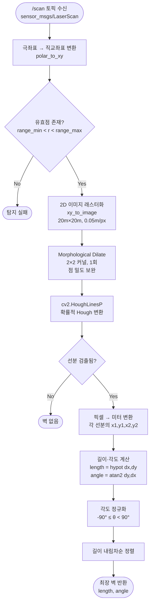
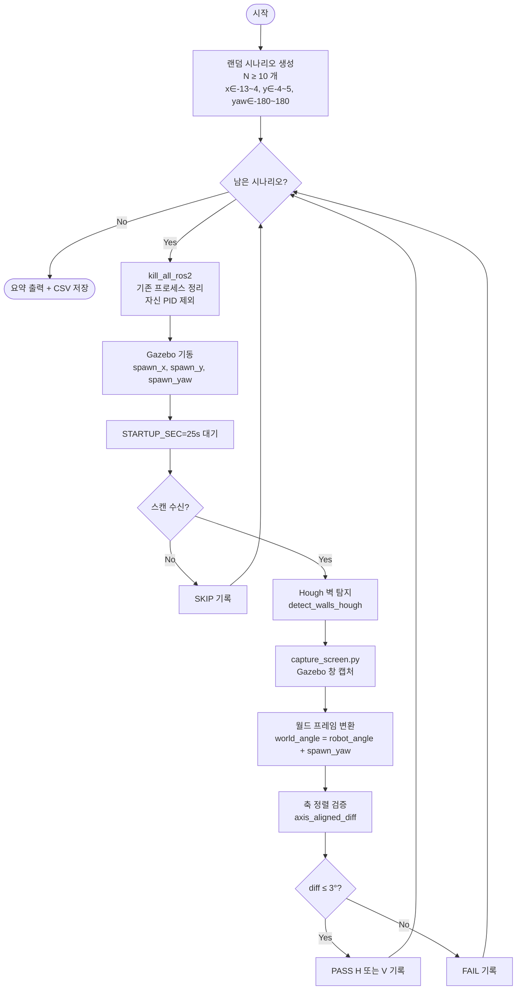
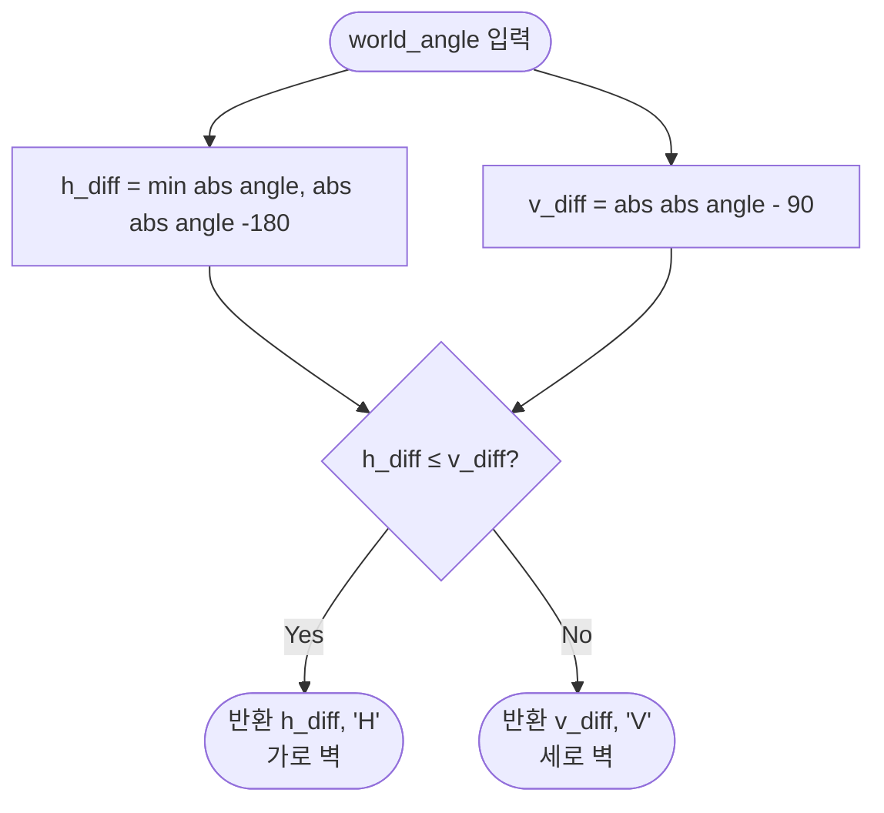

# Hough 기반 벽 탐지 알고리즘 Flowchart

## 1. 전체 파이프라인



## 2. ROS2 노드 레벨 플로우

```mermaid
flowchart TD
    START([노드 기동]) --> SUB[/scan 구독자 생성]
    SUB --> WAIT[스캔 대기<br/>spin_once]
    WAIT --> CB{콜백 수신?}
    CB -- No --> TIMEOUT{타임아웃<br/>6s?}
    TIMEOUT -- No --> WAIT
    TIMEOUT -- Yes --> ERR([오류 로그<br/>종료])
    CB -- Yes --> DONE{처리 완료?}
    DONE -- Yes --> END([종료])
    DONE -- No --> DETECT[벽 탐지 파이프라인<br/>위 1번 Flow]
    DETECT --> PRINT[결과 출력<br/>표 & 순위]
    PRINT --> DONE
```

## 3. SIL 테스트 전체 플로우 (Gazebo 재시작 방식)



## 4. 축 정렬 검증 (axis_aligned_diff)



## 5. ASCII 간략 버전

```
┌─────────────────────────────────────────────────────────────┐
│                    /scan 토픽 수신                           │
│              sensor_msgs/LaserScan (~1800점)                 │
└─────────────────────────────────────────────────────────────┘
                             │
                             ▼
┌─────────────────────────────────────────────────────────────┐
│  [1] 극좌표 → 직교좌표                                       │
│      for each range r at angle θ:                           │
│          if range_min < r < range_max:                      │
│              x = r·cos(θ),  y = r·sin(θ)                    │
└─────────────────────────────────────────────────────────────┘
                             │
                             ▼
┌─────────────────────────────────────────────────────────────┐
│  [2] 이미지 래스터화                                          │
│      20m × 20m 그리드, 해상도 0.05m/픽셀 (801×801)           │
│      각 (x,y) 점 → 백색 픽셀                                 │
│      Dilate 2×2 커널 1회 → 점 밀도 보완                      │
└─────────────────────────────────────────────────────────────┘
                             │
                             ▼
┌─────────────────────────────────────────────────────────────┐
│  [3] 확률적 Hough 변환 cv2.HoughLinesP                       │
│      rho=1px, theta=1°, threshold=30                        │
│      minLineLength=0.8m, maxLineGap=0.15m                   │
│  → 선분 [x1,y1,x2,y2] 배열                                   │
└─────────────────────────────────────────────────────────────┘
                             │
                             ▼
┌─────────────────────────────────────────────────────────────┐
│  [4] 각 선분의 (길이, 각도) 계산                              │
│      length = √(dx² + dy²)                                  │
│      angle  = atan2(dy, dx) → [-90°, 90°) 정규화            │
└─────────────────────────────────────────────────────────────┘
                             │
                             ▼
┌─────────────────────────────────────────────────────────────┐
│  [5] 길이 내림차순 정렬 → 1위 = 최장 벽                      │
└─────────────────────────────────────────────────────────────┘
                             │
                             ▼
┌─────────────────────────────────────────────────────────────┐
│  SIL 검증: world_angle = robot_angle + spawn_yaw            │
│  축 정렬 판정: min(|world_angle mod 90°|) ≤ 3°              │
│    - H 축 (0°) 근접 → 가로 벽                                │
│    - V 축 (90°) 근접 → 세로 벽                               │
└─────────────────────────────────────────────────────────────┘
```

## 6. 파라미터 요약

| 파라미터 | 값 | 역할 |
|---------|-----|------|
| `GRID_RANGE_M` | 20.0 m | 래스터 이미지 반경 |
| `GRID_RES_M` | 0.05 m | 픽셀 해상도 |
| `HOUGH_THRESH` | 30 | Hough 투표 최소값 |
| `MIN_LINE_LEN` | 0.8 m | 최소 선분 길이 |
| `MAX_LINE_GAP` | 0.15 m | 선분 내 최대 갭 |
| `STARTUP_SEC` | 25 s | Gazebo 기동 대기 |
| `ANGLE_TOL_DEG` | 3° | 축 정렬 허용 오차 |
| `N_RANDOM_POSITIONS` | 12 | 랜덤 시나리오 개수 |
