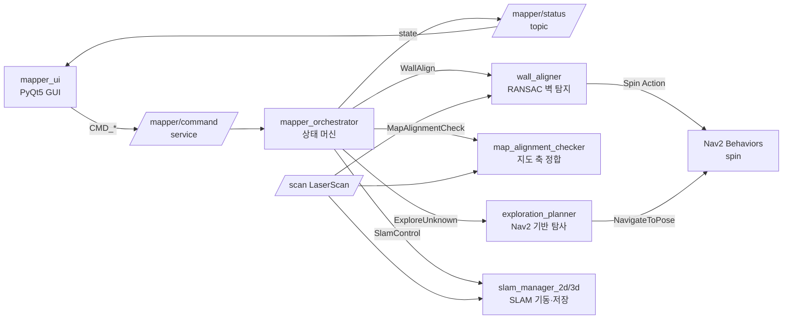
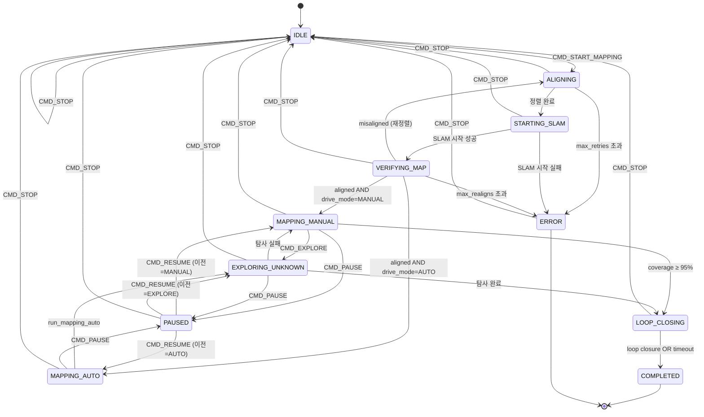
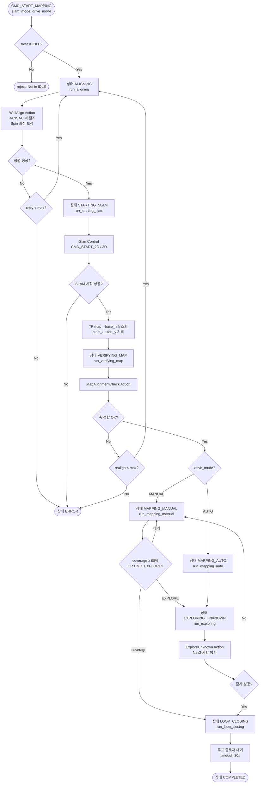
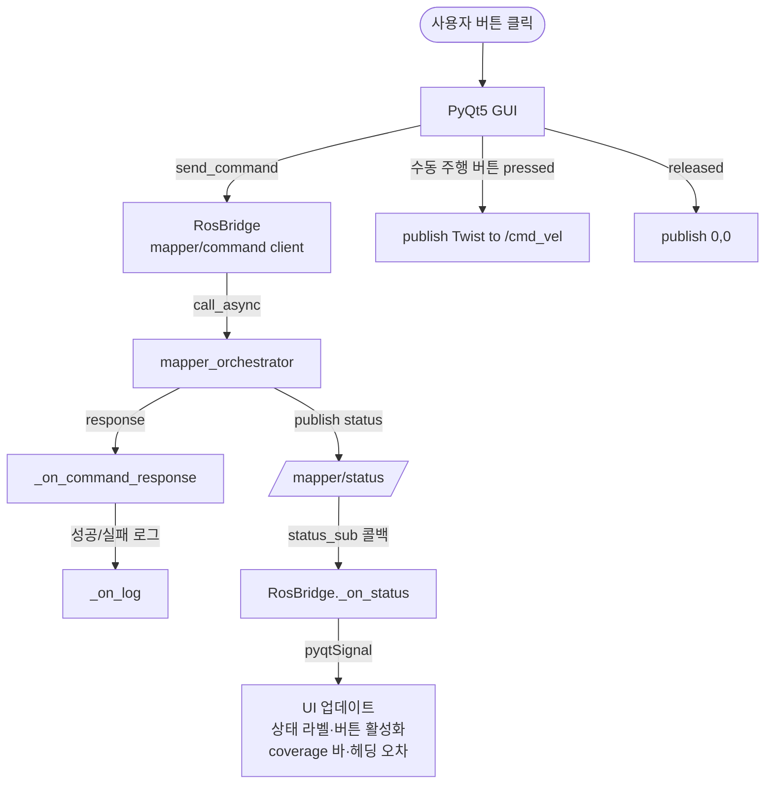

# Mapper System 전체 Flowchart

## 1. 시스템 구성 (노드·인터페이스)



## 2. 상태 머신 (State Machine)



## 3. 전체 매핑 워크플로우



## 4. 벽 정렬(WallAlign) 상세 플로우

```mermaid
flowchart TD
    A([WallAlign Goal<br/>tolerance_deg]) --> SCAN[/scan 최신 수신]
    SCAN --> RANSAC[RANSAC 최장 벽 탐지<br/>iterations=200<br/>inlier_dist=0.05m]
    RANSAC --> WALL[wall_angle_deg]
    WALL --> TF[TF map→base_link 조회<br/>robot_yaw_deg]
    TF --> ERR[error = yaw - wall_angle<br/>정규화 -90~90°]
    ERR --> CHECK{abs error ≤ tolerance?}
    CHECK -- Yes --> SUCCESS([status=0<br/>aligned_heading 반환])
    CHECK -- No --> SPIN[Spin Action 전송<br/>target = yaw - error]
    SPIN --> RETRY{attempt &lt; max?}
    RETRY -- Yes --> SCAN
    RETRY -- No --> FAIL([status=-1 ABORT])
```

## 5. 맵 정합 검사(MapAlignmentCheck) 플로우

```mermaid
flowchart TD
    A([MapAlignmentCheck Goal<br/>tolerance_deg]) --> MAP[/map OccupancyGrid 수신]
    MAP --> EDGE[Canny 엣지 검출]
    EDGE --> HOUGH[Hough 변환<br/>주방향 추출]
    HOUGH --> ANGLE[주 축 각도 계산]
    ANGLE --> CHECK{abs angle &le; tolerance?}
    CHECK -- Yes --> OK([is_aligned=true])
    CHECK -- No --> NOT([is_aligned=false<br/>재정렬 필요])
```

## 6. UI 상호작용 플로우



## 7. 핵심 파라미터 요약

| 파라미터 | 기본값 | 출처 | 역할 |
|---------|--------|------|------|
| `max_align_retries` | 3 | orchestrator | WallAlign 재시도 |
| `map_stabilize_wait_sec` | 3.0 | orchestrator | SLAM 시작 후 지도 안정화 대기 |
| `loop_closure_timeout_sec` | 30.0 | orchestrator | 루프 클로저 대기 타임아웃 |
| `min_coverage_to_stop` | 0.95 | orchestrator | 매핑 완료 커버리지 임계 |
| `tolerance_deg` | 0.2 | wall_aligner | 정렬 각도 오차 허용 |
| `ransac_iterations` | 200 | wall_aligner | RANSAC 반복 |
| `inlier_dist_m` | 0.05 | wall_aligner | Inlier 거리 임계 |
| `min_inliers` | 10 | wall_aligner | 최소 inlier 개수 |
| `spin_speed_deg_s` | 40.0 | wall_aligner | 회전 속도 |

## 8. 상태-명령 호환성 매트릭스

| 상태 | START | PAUSE | RESUME | STOP | SAVE_MAP | EXPLORE |
|------|:-----:|:-----:|:------:|:----:|:--------:|:-------:|
| IDLE | ✅ | ❌ | ❌ | ✅ | ✅* | ❌ |
| ALIGNING | ❌ | ❌ | ❌ | ✅ | ✅* | ❌ |
| STARTING_SLAM | ❌ | ❌ | ❌ | ✅ | ✅* | ❌ |
| VERIFYING_MAP | ❌ | ❌ | ❌ | ✅ | ✅* | ❌ |
| MAPPING_MANUAL | ❌ | ✅ | ❌ | ✅ | ✅ | ✅ |
| MAPPING_AUTO | ❌ | ✅ | ❌ | ✅ | ✅ | ❌ |
| EXPLORING_UNKNOWN | ❌ | ✅ | ❌ | ✅ | ✅ | ❌ |
| LOOP_CLOSING | ❌ | ❌ | ❌ | ✅ | ✅ | ❌ |
| PAUSED | ❌ | ❌ | ✅ | ✅ | ✅ | ❌ |
| COMPLETED | ❌ | ❌ | ❌ | ❌ | ✅ | ❌ |
| ERROR | ❌ | ❌ | ❌ | ✅ | ❌ | ❌ |

✅* = SLAM 서비스 ready일 때만 성공

## 9. 퍼블리시/서브스크라이브 토픽

| 방향 | 토픽 | 타입 | QoS | 발행/구독 노드 |
|-----|------|------|-----|---------------|
| 출력 | `mapper/status` | MapperStatus | RELIABLE | orchestrator → UI |
| 입력 | `scan` | LaserScan | BEST_EFFORT | wall_aligner, map_alignment_checker |
| 입력 | `map` | OccupancyGrid | TRANSIENT_LOCAL | orchestrator, map_alignment_checker |
| 출력 | `cmd_vel` | Twist | default | mapper_ui (수동 주행) |

## 10. 서비스/액션

| 이름 | 타입 | 서버 | 클라이언트 |
|------|------|------|-----------|
| `mapper/command` | Service MapperCommand | orchestrator | UI |
| `wall_align` | Action WallAlign | wall_aligner | orchestrator |
| `map_alignment_check` | Action MapAlignmentCheck | map_alignment_checker | orchestrator |
| `explore_unknown` | Action ExploreUnknown | exploration_planner | orchestrator |
| `spin` | Action Spin (Nav2) | Nav2 Behaviors | wall_aligner |
| `slam_manager_2d/slam_control` | Service SlamControl | slam_manager_2d | orchestrator |
